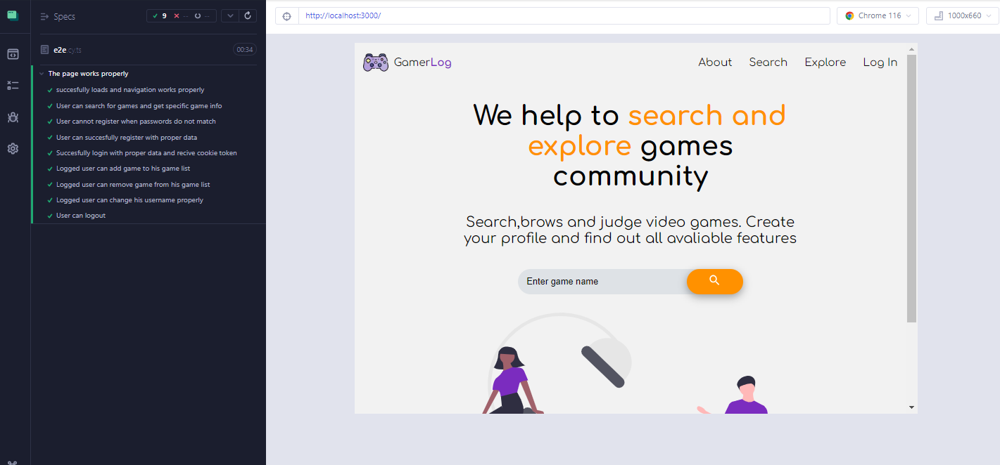
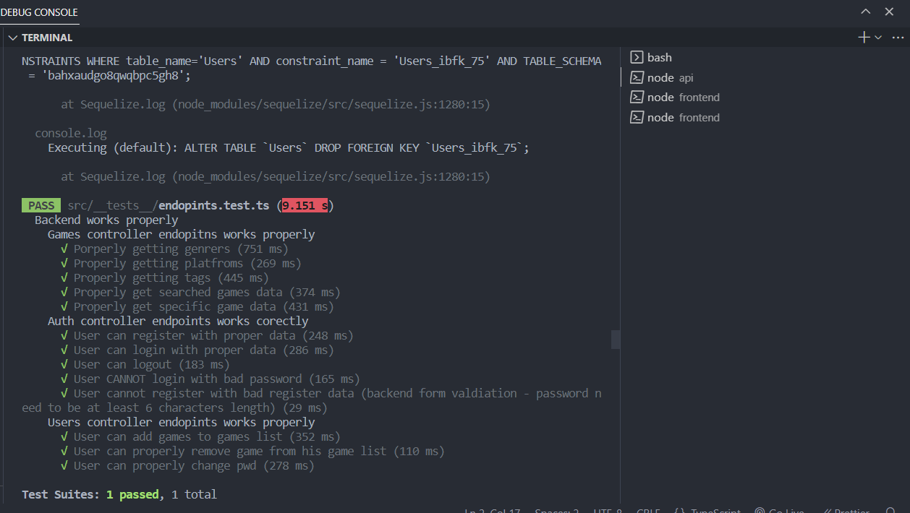

## Project Introduction🖌️

Gamer log 🎮 is a fullstack aplication that help gamers to easy search and explore any kind of games.
It have authentiaction so evry user can easly create account. Authentiacted user has dashboard panel , option to
save/delate games in GameList or WishList and can save and change his game prefenrences - website will delivery best games based on what user like.
User can also manage account data - he is able to change username or password and of course logout.

## Used Technologies 🤖

- Frontend

| Tech            | Description                           |
| --------------- | ------------------------------------- |
| Typescript      | Stongly type language based on Js     |
| React           | Library for bulding user intefaces    |
| Next            | React framework for routing and SSR   |
| Redux           | Library for managing aplication state |
| axios           | Library for http reqests              |
| SCSS            | CSS preprocesor                       |
| Material UI     | UI library                            |
| React hook form | Library for form validation           |
| framer-motion   | Library for animations                |
| Cypress         | E2e testing                           |

- Backend

| Tech       | Description                           |
| ---------- | ------------------------------------- |
| Typescript | Stongly type language based on Js     |
| Node.js    | Javascript runtime                    |
| Express    | Web Node.js framework                 |
| PostgreSql | Relational database                   |
| Sequalize  | Node.js ORM                           |
| Jwt        | Safe auth tokens - refresh and access |
| Joi        | Backend data validation               |
| axios      | Library for http reqests              |
| bcrypt     | Passwords hashing                     |
| Jest       | Unit testing                          |
| Supertest  | Library for testing http servers      |

## Tests🤖

-Frontend (Cypress e2e)

-Backend (Jest and Supertest)

## LIVE 👓

https://gamer-log.vercel.app/

## Test Account

If you do not want to create account  
email : test.test@gmail.com  
password : TestTest#
